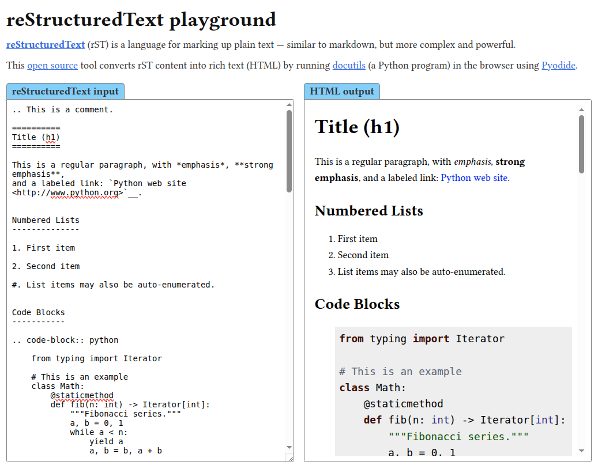

# rst-playground

This is an interactive [reStructuredText](https://docutils.sourceforge.io/rst.html) renderer
working entirely in the browser, allowing anyone to try out the rST syntax and see how it renders,
without needing to set up a server or install any software.

Try it out at <https://waldyrious.github.io/rst-playground>.

| Screenshot                                      |
| ----------------------------------------------- |
|  |

## How it works

The tool is a simple HTML page with a `<textarea>` and an `<iframe>` element side-by-side.
It uses [Pyodide](https://pyodide.org) to call [docutils](https://docutils.sourceforge.io)
to convert plain-text rST-formatted content into HTML-based rich-text.

### Repository structure

The following is an overview of how the repository is organized.

_[Core application files]_<br/>
&ensp;📄 `index.xhtml` — Main HTML page containing the playground interface<br/>
&ensp;📜 `script.js` — JavaScript to convert rST→HTML using Pyodide<br/>
&ensp;🎨 `css/` — Directory with local and upstream CSS stylesheets<br/>

_[Docs & metadata]_<br/>
&ensp;📖 `README.md` — Project documentation (this file)<br/>
&ensp;🖼️ `screenshot.png` — Screenshot of the playground<br/>
&ensp;⚖️ `LICENSE.md` — ISC license text<br/>

_[Config & automation]_<br/>
&ensp;🧹 `.prettierrc.toml` — Code formatting configuration for Prettier<br/>
&ensp;⚙️ `.github/workflows/` — GitHub Actions workflows for automated checks<br/>
&ensp;🔗 `.gitmodules` — Git submodule configuration<br/>
&ensp;🔄 `.renovaterc.json` — Automated updates for submodules and CDN URLs<br/>

## Motivation

**TL;DR:** This project was triggered by the two well-known reStructuredText playgrounds
— [rst.ninjs.org](http://rst.ninjs.org)
<sup>[[src](https://github.com/anru/rsted)]</sup>
and [livesphinx.herokuapp.com](https://livesphinx.herokuapp.com/)
<sup>[[src](https://github.com/readthedocs/livesphinx)]</sup>,
a fork of the former —
having stopped working as of December 2022,
and because I am more used to markdown and too lazy to learn rST properly,
so I find myself often needing such a playground
where I can try out the syntax and see how it renders.
(Also because I've been curious about [Pyodide](https://pyodide.org) for a while,
so it was an opportunity to give it a try.)

### Background and design choices

The original rST parser was created as part of the
[Docutils](https://docutils.sourceforge.io) project,
which remains the authoritative source of the spec
and the most complete implementation.
Indeed, the two defunct browser-based rST playgrounds mentioned above
called back to a server-side renderer in Python, running Docutils code.
There's also a relatively obscure browser-based playground
called [rst-live-preview](https://github.com/frantic1048/rst-live-preview),
which relies on a Python CLI tool called
[rst2html5](https://github.com/marianoguerra/rst2html5/)
(not Docutils' `rst2html`).

To prevent the fate of the previous playgrounds,
I wanted to focus on an alternative that would be extremely easy to host online
— essentially, a fully client-side, static website,
hostable in any free service like GitHub Pages or Neocities,
without requiring a backend server component.
And for that, I needed to run the rST→HTML conversion in JavaScript.

While there are implementations of rST parsers in
[various programming languages](https://stackoverflow.com/q/2746692/266309),
I found no comprehensive and actively developed
[pure-JavaScript implementation](https://stackoverflow.com/q/16335197/266309).
There is [docutils-js](https://github.com/docutils-js/docutils-js),
an attempt to port Docutils to JavaScript,
but it's [incomplete](https://github.com/docutils-js/docutils-js#addendum),
and appears to be abandoned.
There's also [restructured](https://github.com/seikichi/restructured),
which is a similar project, and even has an
[online demo](https://seikichi.github.io/restructured/)!
But unfortunately it too is
[incomplete](https://github.com/seikichi/restructured/#progress)
and [unmaintained](https://github.com/seikichi/restructured/issues/15).

Faced with the challenges of maintaining a full rST parser in JavaScript,
I figured that perhaps [Pyodide](https://pyodide.org) could be used
to run the Python-based `rst2html` directly the in the browser.
Pyodide even has the relevant [packages](https://pyodide.org/en/0.19.1/usage/packages-in-pyodide.html)
([docutils](https://docutils.sourceforge.io) and [pygments](https://pygments.org))
to enable this. Hence, this project was born.

## Contributing

This is a collaborative project, and contributions are welcome!
Check the [open issues](https://github.com/waldyrious/rst-playground/issues) for planned improvements.
You can share feedback by opening new issues or commenting on existing ones.
If you want to contribute more directly, feel free to fork the repository and submit pull requests.

### Development principles

This project is meant to be straightforward, lightweight, and easy to hack.
If you're planning to submit changes, please keep the following principles in mind:

- **Simple web page.**
  The playground must remain fully functional as a plain HTML file loaded directly into the browser.
  No backend, no build steps, no need to run a local server.
- **Straightforward, readable code.**
  The code should be easy to follow for someone with basic programming knowledge,
  without requiring familiarity with modern tooling or trends.
  Avoid clever tricks, terse syntax or layered abstractions.
- **Helpful documentation.**
  Include comments that explain how and why things work, not just what they do.
  Aim to help the next person understand the _reasoning_ behind the implementation.
- **Single purpose.**
  The tool is meant to be a simple and accurate rST renderer — not a full-fledged editor, linter, etc.
  Following the [Unix principle](https://en.wikipedia.org/wiki/Unix_philosophy#Do_One_Thing_and_Do_It_Well),
  it should resist [feature creep](https://en.wikipedia.org/wiki/Feature_creep)
  and avoid adding features beyond this core purpose.

The goal is a clean, maintainable codebase that’s easy to dive into and tweak.
Any contributions that adhere to this philosophy are most welcome!

### Development workflow

This project is hosted on GitHub, so you can contribute by forking the repository
and submitting pull requests (PRs) with your changes.
Simple changes like typos or minor improvements can be done directly in the GitHub web interface,
but for more substantial changes, it's best to clone your fork of the repository and work locally:

```shell
git clone --recurse-submodules https://github.com/<your-username>/rst-playground
```

Then, simply open the `index.xhtml` file in your browser.
There's no need to install anything, run a build step, or set up a local server.
Any edits you make in the HTML, CSS and JavaScript files will be applied by refreshing the page in the browser.

When you open a pull request, you can provide a live preview of your edited version
by setting up your GitHub fork to publish the branch where you are working using GitHub Pages.
Then, your version of the tool will be available at `https://<your-username>.github.io/rst-playground/`.

#### Code formatting

Code formatting is automatically checked on all pull requests using [Prettier](https://prettier.io/).
If you would like to check the syntax of new code locally before submitting a PR,
make sure you have [Node.js installed](https://nodejs.org/en/download),
and run the same command defined in the [workflow](.github/workflows/format-check.yml):

```shell
npx prettier --check . '!css/downstyler'
```

Besides [Prettier's default configuration](https://prettier.io/docs/options),
the [.prettierrc.toml](.prettierrc.toml) file lists additional rules used in this project.

## License

This project is licensed under the [ISC License](LICENSE.md).
